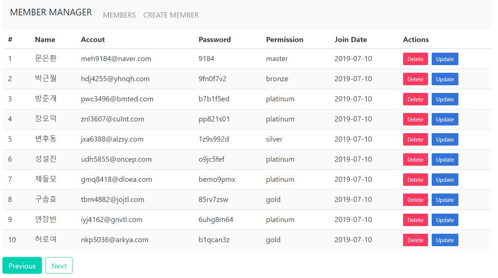
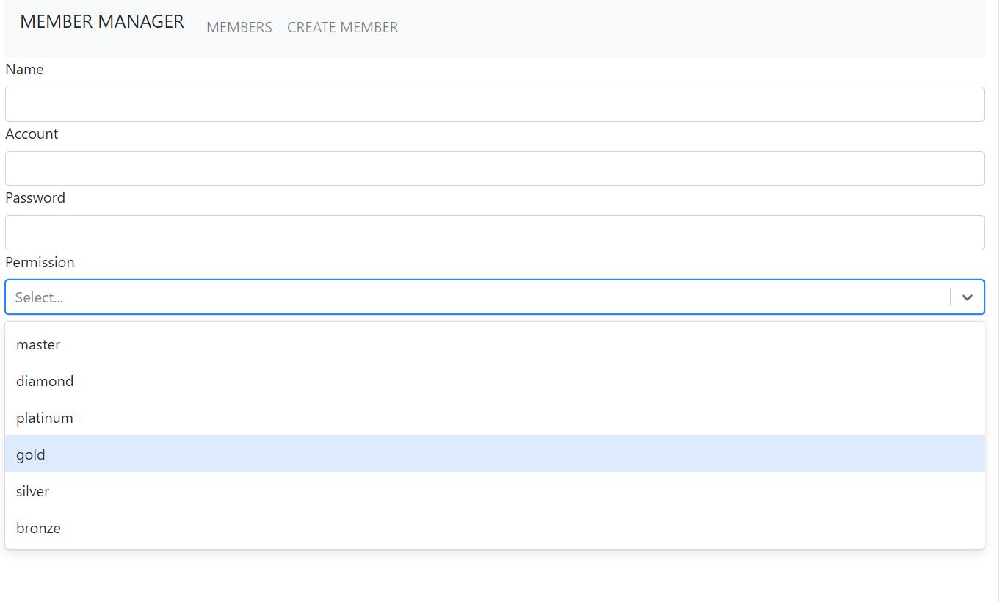
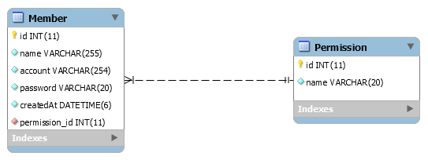
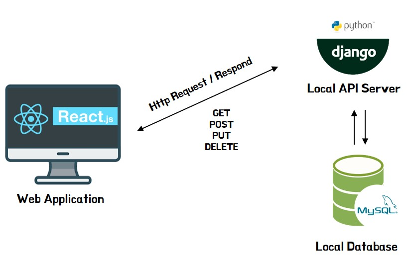
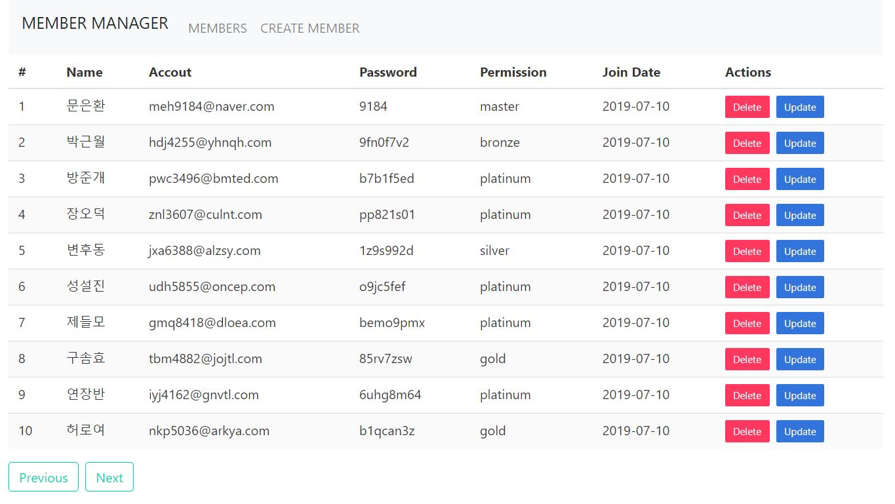
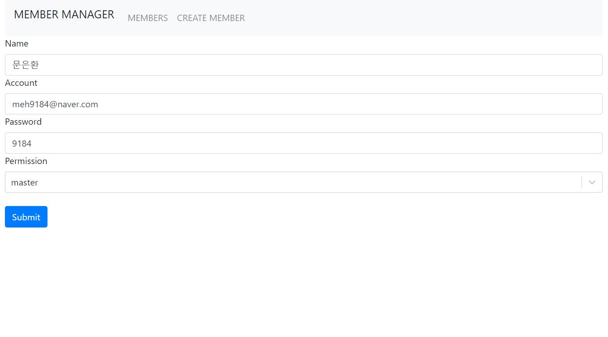

# django-react-member-manager

#### Django와 React를 이용하여 구현한 간단한 회원 관리 Web App

<div>
  <div width='100%'>
    <kbd>
      
    </kbd>
  </div>
  <br>
  <div width='100%'>
    <kbd>
      
    </kbd>
  </div>
</div>
<br>

<br/>

## *Introduction*


### Summary
> - 간단한 회원관리 웹 어플리케이션을 구현
> 
> - BACK-END : Django를 이용하여 회원 정보 저장용 REST API를 구현
>
> - FRONT-END : React를 이용하여 회원 정보 CRUD 제공할 웹 어플리케이션 구현
> 
> - 웹 브라우저를 통해 CRUD 서비스
> 
> - 서버는 REST하게 설계되었기 때문에 HTTP 의 ruequst 이용한 CRUD 서비스도 가능


### Requirements
> - [Python 3.6](https://www.python.org/downloads/release/python-360/) 
> - [Django 2.2.3](https://docs.djangoproject.com/en/2.2/releases/2.2.3/)
> - [React 16.8.6](https://www.npmjs.com/package/react?activeTab=versions)
> - [MySQL 5.6](https://dev.mysql.com/downloads/mysql/5.6.html)


### End-points

> **Resource modeling**
> 
> - 회원(Member) 리소스를 RESTful하게 모델링
> 
>   |  HTTP |  Path |  Method |  목적 |
>   | --- | --- | --- | --- |
>   |**GET** |/api/member|Create|Member 생성 Form|
>   |**GET** |/api/members|List|모든 Member 조회|
>   |**POST** |/api/members|Create|하나의 Member 생성|
>   |**GET** |/api/members/member_id|Read|하나의 Member 조회|
>   |**PUT** |/api/members/member_id|Update|하나의 Member 수정|
>   |**DELETE** |/api/members/member_id|Delete|하나의 Member 삭제|
> 
> **Urls**
> 
> - `backend/django_member_manager/django_member_manager/urls.py`
> ```python
> from django.contrib import admin
> from django.urls import path
> from members import views
> from django.conf.urls import url
> 
> urlpatterns = [
>     path('admin/', admin.site.urls),
>     url(r'^api/members/$', views.members_list),
>     url(r'^api/members/(?P<pk>[0-9]+)$', views.members_detail),
> ]
> ```

### Models
> 
> **Database schema**
> 
>   

### System configuration
> 
> **Service flow**
> 
>   

<br/>

## *Installation*

### Clone project
> 
> - Github repository를 clone
> ```bash
> $ git clone https://github.com/meh9184/django-react-member-manager.git
> ```
> 

### Configure  db connection
> 
> - `backend/django_member_manager/django_member_manager/settings.py` 파일의
> - DATABASES 부분 USER, PASSWORD 입력
> 
> ```python
> # Database
> # https://docs.djangoproject.com/en/2.2/ref/settings/#databases
> 
> DATABASES = {
>     'default': {
>         'ENGINE': 'django.db.backends.mysql',
>         'NAME': 'member_manager',
>         'USER': 'INSERT HERE',        # 여기에 입력
>         'PASSWORD': 'INSERT HERE',    # 여기에 입력
>         'HOST': '127.0.0.1',
>         'PORT': '3306'
>     }
> }
> ```

### Create mysql schema 
> 
> - MySQL CLI 상에서 `member_manager` 이름으로 스키마 생성
> ```bash
> mysql> create schema member_manager;
> ```

### Backend installation

> - backend 디렉터리 `django-react-member-manager/backend`로 이동
> ```bash
> $ cd backend
> ```
>
> - virtaulenv 설치 안됐다면 apt-get으로 설치하고,
> - virtaulenv 명령어로 현재 디렉터리에 가상환경 `venv` 생성 및 활성화
> ```bash
> $ sudo apt-get install virtualenv
> $ virtualenv --python=python3 venv
> $ source venv/bin/activate
> ```
>
> - libmysqlclient 설치 및
> - 현재 가상 환경에 requirements.txt의 dependencies 설치
> ```bash
> $ sudo apt-get install libmysqlclient-dev
> $ pip install -r requirements.txt
> ```
>
> - DB 모델을 migrate 하기 위해 `django-react-member-manager/backend/django_member_manager/`로 이동
> ```bash
> $ cd django_member_manager
> ```
>
> - DB migration 생성하고 migrate 명령어를 통해 MySQL에 테이블 생성
> ```bash
> $ python manage.py makemigrations
> $ python manage.py migrate
> ```
>
> - migrate 작업 완료됐으면 서버 실행
> ```bash
> $ python manage.py runserver
> ```

### Frontend Installation

> - 새로운 쉘 생성하여 frontend 디렉터리 `django-react-member-manager/frontend`로 이동
> ```bash
> $ cd frontend
> ```
>
> - yarn 설치 안됐다면 apt-get으로 설치하고,
> - yarn install 명령어로 노드 모듈 셋업
> ```bash
> $ sudo apt-get install yarn
> $ yarn install
> ```
>
> - install 완료 됐으면 react-app 실행
> ```bash
> $ yarn start
> ```

<br/>

## *Usage*


### Generate data

> - 위의 Step대로 진행하여 서버 setting 및 run까지 완료했다면, 현재 DB는 비어있고
> - python manage.py migrate 명령에서 실행한 002_create_permissions.py를 통해 
> - Permission 초기 값들(6개 권한 값들)만 생성된 상태
> ```bash
> mysql> SELECT * FROM members_manager.members_permission;
> ```
>   |  ID |  NAME |
>   | --- | --- |
>   |1 |master|
>   |2 |diamond|
>   |3 |platinum|
>   |4 |gold|
>   |5 |silver|
>   |6 |bronze|
> </br>
> 
> - master 권한의 member 와 랜덤한 member들을 생성하기 위해 
> - 새로운 쉘을 생성하여 `/backend/venv` 가상환경 activate 시키고, `/backend/django_member_manager` 폴더로 이동
> ```bash
> $ cd backend
> $ source venv/bin/activate
> $ cd django_member_manager
> ```
>
> - createmastermember 커스텀 명령어로 master member 생성
> ```bash
> $ python manage.py createmastermember
> ```
>
> - makemembers 커스텀 명령어로 n개의 랜덤한 member 생성
> - Usage ex) python manage.py makemembers 30  -> 30개의 랜덤한 member 생성
> - Usage ex) python manage.py makemembers 220 -> 220개의 랜덤한 member 생성
> ```bash
> $ python manage.py makemembers 30
> ```
> 
> - 웹 브라우저로 접속하여 데이터 잘 추가 되었는지 확인
>   - [http://localhost:3000/](http://localhost:3000/)
> 
> - React app 상단의 CREATE MEMBER / MEMBERS 를 통해 `CREATE` / `READ` 동작 수행
> - 각 Members 컴포넌트의 Update / Delete 버튼을 통해 `UPDATE` / `DELETE` 동작 수행  
> 


<br/>

## *Results*

### Views
> 
> ### List
> 
> |  HTTP |  Path |  Method |  목적 |
> | --- | --- | --- | --- |
> |**GET** |/api/members|List|모든 Member 조회|
>
> <kbd>
>   
> </kbd>
> <br/>
> <br/>
> 
> ### Read / Update
> 
> |  HTTP |  Path |  Method |  목적 |
> | --- | --- | --- | --- |
> |**GET** |/api/members/member_id|Read|하나의 Member 조회|
> |**UPDATE** |/api/members/member_id|Update|하나의 Member 수정|
>
> <kbd>
>   
> </kbd>
> <br/>
> <br/>
>  
> ### Create
> 
> |  HTTP |  Path |  Method |  목적 |
> | --- | --- | --- | --- |
> |**GET** |/api/member|Create|Member 생성 Form|
>
> <kbd>
>   
> </kbd>
> <br/>
> <br/>
> 

<br/>

## *Addition Commentary*
> 
### Issues
> - master 권한을 갖는 회원은 단 1명으로 제한
> - 그러나, 서버/DB 단에서 제어하는 것이 아닌 Frontend 상에서 회원을 생성하는 경우 자체적으로 걸러내도록 구현
> - 따라서 DB에 직접적으로 접근한다면 1명 이상의 회원이 master 권한을 갖는 경우 발생 

### Tools for Windows OS Users
> - [WSL (Windows Subsystem for Linux)](https://docs.microsoft.com/ko-kr/windows/wsl/install-win10)
> - [VSCode](https://code.visualstudio.com/docs/?dv=win)
> - [Mysql Workbench](https://www.mysql.com/products/workbench/)
> - [Postman](https://www.getpostman.com/downloads/)
> - [Github](https://github.com/meh9184/tmdb-rails)
> 

<br/>

## *References*
> 
> - https://docs.djangoproject.com/ko/2.2/
> - https://velog.io/@odini/series/React-%EA%B3%B5%EC%8B%9D%EB%AC%B8%EC%84%9C
> - https://docs.microsoft.com/ko-kr/windows/wsl/install-win10
> - https://gorails.com/setup/windows/10
